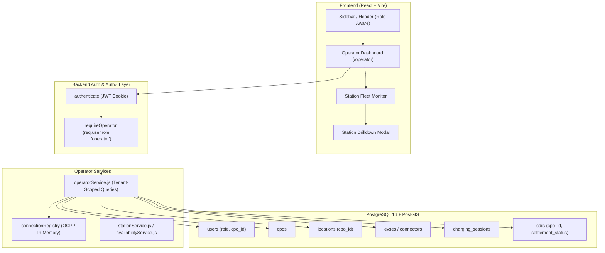

# VahanGrid — Phase 4A Investigation: Operator Dashboard

**Status:** Complete  
**Date:** October 10, 2026  
**Auditor / Investigator:** Senior Full-Stack Engineer  
**Baseline Commit:** `06ff0c5` (`fix: stabilize theme and payment regressions`)  
**Scope:** Architectural and feasibility investigation only (no application code modified)

---

## Executive Summary

VahanGrid currently functions as a driver-centric EV charging and roaming platform with real-time OCPP 2.0.1 charge point communication, authoritative CDR billing, wallet settlement, and Razorpay payment integration. However, **no operator-specific data access, role-based authorization, or operator dashboard UI currently exists**.

The database models (`cpos`, `locations`, `evses`, `connectors`, `cdrs`, `tariffs`, `ocpp_charge_points`) already possess strong relational structures tying physical hardware and financial records to CPOs (`cpos.id`). The primary architectural missing link is that the `users` table lacks a `role` and a link to `cpos`.

This investigation outlines the smallest secure architecture to introduce an **Operator Dashboard MVP**, enabling Charge Point Operators (CPOs) like Tata Power, Statiq, and ChargeZone to monitor their station uptime, track active charging sessions, and inspect revenue and settlement analytics—without compromising tenant isolation or leaking driver personal data.

---

## 1. Existing Capabilities & Reusable Components

### 1.1 Relational & Spatial Database Layer (PostgreSQL + PostGIS)
| Model / Table | Existing Fields Relevant to Operators | Current Capabilities |
|---|---|---|
| `cpos` | `id`, `name`, `short_code`, `status`, `support_phone`, `support_email` | Models CPO entities (Tata Power, Statiq, ChargeZone, Jio-bp, Kazam). |
| `locations` | `id`, `cpo_id` (FK `cpos.id`), `name`, `city`, `state`, `latitude`, `longitude`, `status` | Direct 1:N relationship with CPOs. Indexed by `cpo_id` (`idx_locations_cpo_id`). |
| `evses` | `id`, `location_id` (FK `locations.id`), `evse_uid`, `status`, `max_power_kw` | Hardware kiosk records with operational statuses (`available`, `charging`, `faulted`, `offline`). |
| `connectors` | `id`, `evse_id` (FK `evses.id`), `connector_id`, `standard`, `power_type`, `max_power_kw`, `status` | Physical plug interfaces with electrical ratings and real-time status. |
| `charging_sessions` | `id`, `user_id`, `connector_id`, `started_at`, `ended_at`, `energy_kwh`, `cost_amount`, `status` | Session lifecycle tracking. Connects to CPO via `connectors -> evses -> locations -> cpos`. |
| `cdrs` | `id`, `session_id`, `cpo_id` (FK `cpos.id`), `location_id`, `energy_kwh`, `subtotal`, `tax_amount`, `total_amount`, `settlement_status` | Authoritative, immutable financial billing records with explicit `cpo_id` foreign key and dedicated index `idx_cdrs_cpo_id`. |
| `tariffs` | `id`, `cpo_id`, `location_id`, `price_per_kwh`, `session_fee`, `tax_rate`, `is_active` | Configurable pricing hierarchy attached to CPOs and stations. |
| `ocpp_charge_points` | `id`, `charge_point_id`, `location_id`, `registration_status`, `status`, `last_boot_at` | OCPP 2.0.1 device registry linked to physical locations. |
| `ocpp_session_telemetry` | `session_id`, `recorded_at`, `power_kw`, `soc_percent`, `energy_kwh` | Time-series telemetry curves captured during active charging sessions. |

### 1.2 Backend Services & Hardware Integration
- **`stationService.js`**: Reusable hierarchical queries extracting locations, nested EVSEs, and connectors.
- **`availabilityService.js`**: Executes OCPP 2.0.1 `ChangeAvailability` requests (`Operative` / `Inoperative`) via WebSocket connection registry.
- **`remoteOperationService.js`**: Executes OCPP 2.0.1 `Reset` (Immediate / OnIdle), `UnlockConnector`, and `TriggerMessage`.
- **`connectionRegistry.js`**: In-memory registry tracking live WebSocket connections, recent boot notifications, heartbeats, and transient meter values.
- **`cdrService.js`**: Manages CDR finalization, retrieval, and status reporting.
- **`walletSettlementService.js`**: Executes automated wallet balance debits against finalized CDRs.

### 1.3 Frontend Architecture & Design System
- **Layout Foundation**: Responsive `Sidebar.jsx`, `Header.jsx`, and `BottomNav.jsx` supporting collapsible states and mobile drawers.
- **Design System Tokens**: Fully implemented Tailwind CSS v4 styling with glassmorphism classes (`.glass`, `.glass-card`, `.panel-surface`) and synchronized light/dark mode support (`document.documentElement.classList.add('light-theme')`).
- **Telemetry & Visualization**: Native SVG charting pattern (`PowerCurveChart.jsx`) demonstrating interactive, responsive curve rendering without third-party chart dependencies.
- **Live Polling Infrastructure**: Proven pattern in `useChargingTelemetry` hook with interval management, loading states, and error handling.

---

## 2. Identified Gaps

### 2.1 Role & Authentication Gaps (Critical Security Finding)
1. **No User Roles in Database**:
   - The `users` table schema (`002_create_users.sql`) only has `id`, `name`, `email`, `phone`, `password_hash`, `created_at`, `updated_at`.
   - There is no `role` column. Every authenticated user is currently treated identically.
2. **No User-to-CPO Association**:
   - There is no link between `users` and `cpos`. It is currently impossible to determine which CPO an operator user belongs to.
3. **No Role-Enforcing Middleware**:
   - `authenticate.js` verifies the JWT cookie and loads `req.user`, but no role verification exists.
   - Any authenticated driver can currently invoke administrative endpoints such as:
     - `POST /api/v1/stations/:id/availability` (can take chargers offline).
     - `POST /api/v1/stations/:id/reset` (can reboot chargers).
     - `POST /api/v1/stations/:id/charging-profiles` (can alter power limits).
     - `POST /api/v1/tariffs`, `PATCH /api/v1/tariffs/:id`, `DELETE /api/v1/tariffs/:id` (can mutate pricing).

### 2.2 API Surface Gaps
1. **No Operator Overview Endpoint**: No endpoint aggregates total managed stations, online chargers, active session count, or recent revenue for a CPO.
2. **Driver-Scoped Session APIs**: Existing `GET /api/v1/sessions` and `GET /api/v1/sessions/active` strictly filter by `WHERE user_id = req.user.id`. Operators have no query to view sessions occurring across their charging hardware.
3. **No Operator Settlement / Financial Summary**: While `cdrs` has `cpo_id`, no endpoint aggregates revenue, tax breakdown, or settlement status for an operator.
4. **No Station Operational Health Detail**: No endpoint provides an operator view combining station metadata with live OCPP connection status, heartbeat latency, and connector fault flags.

### 2.3 Frontend Gaps
1. **Single Driver Perspective**: The navigation menu (`NAV_ITEMS`) and all existing views assume the user is an EV driver.
2. **No Operator View or Route**: No operator dashboard, station management table, or network monitoring view exists.
3. **No Role-Aware Navigation Switcher**: No capability for users to switch between or view an operator console.

---

## 3. Proposed Operator Dashboard Architecture



### Core Architecture Principles:
1. **Strict Server-Authoritative Multi-Tenancy**:
   - Never trust frontend claims of CPO identity.
   - The operator's authorized `cpo_id` is retrieved strictly from the database during JWT verification.
   - Every operator query automatically injects `WHERE cpo_id = req.user.cpo_id` (or joins via `locations.cpo_id = req.user.cpo_id`).
   - IDOR (Insecure Direct Object Reference) is mathematically prevented: an operator requesting a station or session belonging to another CPO receives a `404 Not Found` or `403 Forbidden`.
2. **Minimal Schema footprint**:
   - Direct 1:1 CPO operator association (`users.role` + `users.cpo_id`) satisfies all MVP requirements without introducing complex multi-tenant junction tables or permission matrices.
3. **Driver Privacy Protection (DPDP Act Compliance)**:
   - When returning session history to CPO operators, sensitive driver PII (phone number, email) is masked (e.g. `Priya S.`, `+91 98*** 43210`) or omitted.

---

## 4. Required API Endpoints & Authorization Rules

All operator endpoints reside under `/api/v1/operator` and require both `authenticate` and `requireOperator` middleware.

### 4.1 `GET /api/v1/operator/overview`
- **Description**: High-level network summary metrics for the operator dashboard.
- **Authorization**: `authenticate`, `requireOperator`. Scoped to `req.user.cpo_id`.
- **Response**:
```json
{
  "success": true,
  "data": {
    "cpo": {
      "id": "a0000001-0000-0000-0000-000000000001",
      "name": "Tata Power EZ Charge",
      "short_code": "TATA_EZ"
    },
    "stations": {
      "total": 12,
      "online": 11,
      "offline": 1,
      "faulted": 0
    },
    "connectors": {
      "total": 36,
      "available": 22,
      "charging": 10,
      "offline": 4
    },
    "active_sessions_count": 10,
    "metrics_period": "30d",
    "metrics": {
      "total_sessions": 348,
      "total_energy_kwh": 8940.5,
      "total_revenue_inr": 187750.50,
      "settled_revenue_inr": 178360.00,
      "settlement_rate_percent": 95.0
    }
  }
}
```

### 4.2 `GET /api/v1/operator/stations`
- **Description**: List of all stations managed by the operator with operational health.
- **Query Params**: `status` (all | active | inactive), `city`, `search`.
- **Authorization**: `authenticate`, `requireOperator`. Scoped to `locations.cpo_id = req.user.cpo_id`.
- **Response**:
```json
{
  "success": true,
  "data": [
    {
      "id": "f0000001-0000-0000-0000-000000000001",
      "name": "Tata Power EZ Charge - Aerocity Hub",
      "city": "New Delhi",
      "state": "Delhi",
      "status": "active",
      "ocpp_status": "online",
      "evse_count": 4,
      "connector_count": 8,
      "available_connectors": 5,
      "active_sessions": 2,
      "last_heartbeat_at": "2026-10-10T00:05:00.000Z"
    }
  ]
}
```

### 4.3 `GET /api/v1/operator/stations/:id`
- **Description**: Station drilldown view with nested EVSEs, connectors, active session details, and registered OCPP charge point hardware.
- **Authorization**: `authenticate`, `requireOperator`. Validates `station.cpo_id === req.user.cpo_id`.
- **Errors**: `404 STATION_NOT_FOUND` if ID does not exist or belongs to another CPO.

### 4.4 `GET /api/v1/operator/sessions`
- **Description**: Real-time active and recent charging sessions across the operator's stations.
- **Query Params**: `status` (active | completed | stopped | all), `station_id`, `limit` (default 20), `offset` (default 0).
- **Authorization**: `authenticate`, `requireOperator`. Joins on `connectors -> evses -> locations` where `locations.cpo_id = req.user.cpo_id`.
- **Driver Privacy**: Driver name displayed as first name + initial (e.g. `Rahul V.`); phone and email excluded.

### 4.5 `GET /api/v1/operator/analytics`
- **Description**: Daily/hourly aggregated trend metrics for energy and revenue charts.
- **Query Params**: `period` (24h | 7d | 30d).
- **Authorization**: `authenticate`, `requireOperator`. Scoped to `cdrs.cpo_id = req.user.cpo_id`.
- **Response**: Array of time buckets (`bucket_start`, `session_count`, `energy_kwh`, `revenue_inr`).

### 4.6 Existing Endpoint Hardening
Existing station remote operations in `backend/src/routes/stations.js` must be updated to restrict access to authorized operators of that station:
- `POST /api/v1/stations/:id/availability` -> verifies operator owns station.
- `POST /api/v1/stations/:id/reset` -> verifies operator owns station.
- `POST /api/v1/stations/:id/unlock-connector` -> verifies operator owns station.
- `POST /api/v1/stations/:id/charging-profiles` -> verifies operator owns station.

---

## 5. Required Database Changes

Only **one clean migration** is required: `022_add_user_roles_and_cpo_association.sql`.

```sql
-- 022_add_user_roles_and_cpo_association.sql
-- Adds role-based access control and CPO organizational association to users.

-- 1. Add role and cpo_id columns
ALTER TABLE users
  ADD COLUMN IF NOT EXISTS role VARCHAR(20) NOT NULL DEFAULT 'driver',
  ADD COLUMN IF NOT EXISTS cpo_id UUID REFERENCES cpos(id) ON DELETE SET NULL;

-- 2. Enforce valid role enum values
DO $$
BEGIN
  IF NOT EXISTS (
    SELECT 1 FROM pg_constraint WHERE conname = 'chk_user_role'
  ) THEN
    ALTER TABLE users
      ADD CONSTRAINT chk_user_role
      CHECK (role IN ('driver', 'operator', 'admin'));
  END IF;
END $$;

-- 3. Enforce that operator role must be linked to a valid CPO
DO $$
BEGIN
  IF NOT EXISTS (
    SELECT 1 FROM pg_constraint WHERE conname = 'chk_operator_cpo_id'
  ) THEN
    ALTER TABLE users
      ADD CONSTRAINT chk_operator_cpo_id
      CHECK (role != 'operator' OR cpo_id IS NOT NULL);
  END IF;
END $$;

-- 4. Create performance indexes
CREATE INDEX IF NOT EXISTS idx_users_role   ON users(role);
CREATE INDEX IF NOT EXISTS idx_users_cpo_id ON users(cpo_id);
```

### Seed Data Additions (`backend/database/seeds/001_seed_development_data.sql`):
Add development operator accounts for testability:
1. `tata.operator@tatapower.com` (`role = 'operator'`, `cpo_id = 'a0000001-...-0001'` [Tata Power], password `Demo@1234`).
2. `statiq.operator@statiq.in` (`role = 'operator'`, `cpo_id = 'a0000001-...-0002'` [Statiq], password `Demo@1234`).

---

## 6. Frontend Pages & Component Plan

### 6.1 View & Routing Architecture
- **Role Awareness in `AuthContext`**: Expose `isOperator: user?.role === 'operator'`, `userRole: user?.role`, `cpoId: user?.cpo_id`.
- **Navigation Toggle**:
  - In `Sidebar.jsx`, if `user.role === 'operator'`, render a prominent portal badge ("Operator Mode") and add navigation item:
    - `{ id: 'operator', label: 'Operator Portal', icon: Building2 }`
  - When in Operator Portal, the navigation focuses on Operator views:
    - Overview (KPIs, Charts, Live Sessions)
    - Stations (Fleet Status, EVSE/Connector inspection, Remote actions)
    - Financials (CDR Settlement audit)
  - Seamless toggle allows the operator to switch back to Driver view anytime.

### 6.2 New Component Hierarchy
```
frontend/src/
├── pages/
│   └── Operator/
│       ├── OperatorDashboardPage.jsx      // Main operator console
│       └── OperatorStationsPage.jsx       // Fleet monitoring table/grid
├── components/
│   └── operator/
│       ├── OperatorMetricCard.jsx         // KPI summary card with trend pills
│       ├── OperatorAnalyticsChart.jsx     // Responsive native SVG revenue & energy chart
│       ├── OperatorLiveSessionTable.jsx   // Active charging session feed with live counters
│       ├── OperatorStationRow.jsx         // Station health row with OCPP indicator
│       └── OperatorStationModal.jsx       // Drilldown modal with remote action buttons
└── services/
    └── operatorService.js                 // API client for /api/v1/operator endpoints
```

### 6.3 UI States & Visual Design
- **Theme Compliance**: Fully inherits existing glassmorphism tokens (`.glass`, `.panel-surface`, `.border-white/[.08]`) and adapts seamlessly to `.light-theme`.
- **Loading State**: Shimmer skeleton blocks for KPI cards and table rows during initial fetch.
- **Empty State**: Friendly Indian EV ecosystem illustration and clear messaging when no active sessions or stations are found.
- **Error State**: Non-blocking alert banners with manual "Retry" triggers.
- **Stale Data Indicator**: Subtle badge ("Updated 12s ago • Auto-refreshing every 30s") with an instant refresh button.

---

## 7. Test Strategy & Acceptance Criteria

### 7.1 Backend Acceptance Criteria
1. **Security & Authorization**:
   - `GET /api/v1/operator/overview` without token returns `401 MISSING_TOKEN`.
   - Driver account calling `/api/v1/operator/overview` returns `403 FORBIDDEN_OPERATOR_REQUIRED`.
   - Tata Power operator querying station belonging to Statiq returns `404 STATION_NOT_FOUND` (preventing IDOR).
   - Driver attempting `POST /api/v1/stations/:id/reset` returns `403 FORBIDDEN`.
2. **Data Accuracy**:
   - `GET /api/v1/operator/overview` metrics match the sum of finalized CDRs for that CPO in PostgreSQL.
   - Active sessions accurately reflect sessions on connectors belonging to that CPO's locations.

### 7.2 Frontend Acceptance Criteria
1. Driver login displays existing driver interface without operator controls.
2. Operator login enables Operator Portal access and displays CPO branding.
3. Metric cards, SVG charts, and session tables render cleanly without console errors or layout shifts.
4. All text, borders, and backgrounds pass WCAG AA contrast in both Dark and Light modes.

---

## 8. Ordered Implementation Tasks & Complexity

| Task # | Task Description | Files Touched | Complexity |
|---|---|---|---|
| **Task 1** | **Database Migration & Seed Data**<br>Add `role` and `cpo_id` to `users`, update development seeds with operator test accounts. | `022_add_user_roles_and_cpo_association.sql`, `001_seed_development_data.sql` | **Low** (~1 hr) |
| **Task 2** | **Authorization Middleware & Endpoint Hardening**<br>Implement `requireOperator` middleware; update `getUserById` in `authService.js`; secure existing remote station endpoints. | `src/middleware/authorize.js`, `src/services/authService.js`, `src/controllers/stationController.js` | **Low-Medium** (~1.5 hrs) |
| **Task 3** | **Operator Backend Service & Endpoints**<br>Build `operatorService.js`, `operatorController.js`, and mount `/api/v1/operator` routes with unit tests. | `src/services/operatorService.js`, `src/controllers/operatorController.js`, `src/routes/operator.js` | **Medium** (~2.5 hrs) |
| **Task 4** | **Frontend Service & Auth Context Integration**<br>Implement `operatorService.js`, update `AuthContext.jsx` with role metadata. | `frontend/src/services/operatorService.js`, `frontend/src/context/AuthContext.jsx` | **Low** (~1 hr) |
| **Task 5** | **Operator Dashboard Page & Native SVG Chart**<br>Build `OperatorDashboardPage`, KPI cards, responsive SVG trend chart, and active session table. | `frontend/src/pages/Operator/OperatorDashboardPage.jsx`, components | **Medium-High** (~3 hrs) |
| **Task 6** | **Station Fleet Monitor & Drilldown Modal**<br>Build station health table and drilldown inspection modal with remote action triggers. | `frontend/src/components/operator/OperatorStationModal.jsx` | **Medium** (~2 hrs) |
| **Task 7** | **Regression Testing & Documentation**<br>Execute full test suite, verify light/dark themes, update `docs/PROGRESS.md` and `docs/API.md`. | Documentation, Test scripts | **Low** (~1 hr) |

---

## 9. Risks & Decisions Needing Confirmation

| # | Topic | Technical Trade-off | Recommended Decision |
|---|---|---|---|
| 1 | **Operator-to-CPO Cardinality** | Option A: `users.cpo_id` (1 CPO per operator user).<br>Option B: `cpo_operators` junction table (multi-CPO operators). | **Recommend Option A**. Simple, zero-join auth check, matches real-world CPO operations where staff belong to a single network. |
| 2 | **Driver PII in Operator Views** | Exposing full driver name/phone vs Masking PII in session tables. | **Recommend Masking**. Protects driver privacy under Indian DPDP Act regulations while providing sufficient operational context. |
| 3 | **Remote Controls in MVP** | Inclusion of hardware reboot/availability controls in MVP vs Read-only dashboard first. | **Recommend Read-only first (Tasks 1-5)**, then remote controls as an explicit interactive step (Task 6) with confirmation dialogs. |

---

## Conclusion & Recommended Next Step

The architecture for Phase 4 is clean, highly feasible, and requires zero speculative dependencies (no Kafka, Redis, or microservices needed).

**Recommended Exact Next Step:**  
When instructed to begin implementation, proceed with **Task 1: Database Migration & Seed Updates**, creating `backend/database/migrations/022_add_user_roles_and_cpo_association.sql` and seeding operator test credentials.
